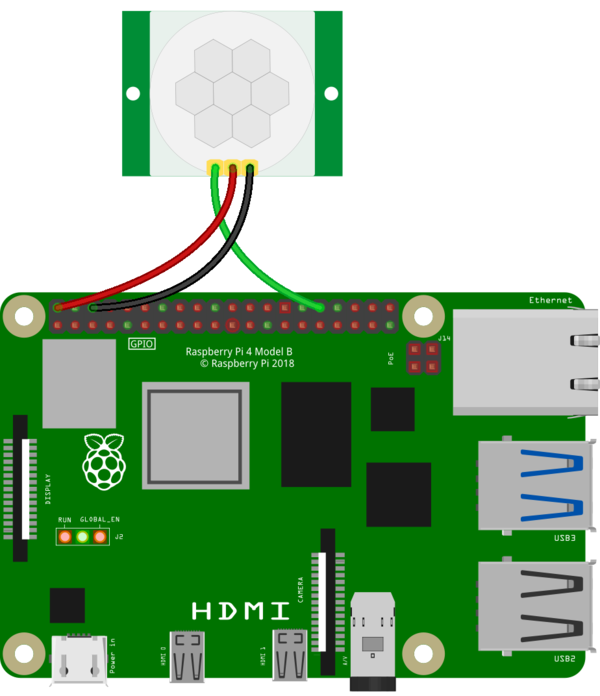

## Using the Flight Unit PIR

The PIR (Passive Infrared) motion sensors on the Flight Units aboard the ISS are connected as shown in the diagram below.

You can look at all the available methods for the `MotionSensor` class in the [gpiozero documentation](https://gpiozero.readthedocs.io/en/stable/api_input.html#motionsensor-d-sun-pir)

There are three main ways to detect motion.

The first will pause your program until motion is detected, and then continue. An example is shown below.

--- code ---
---
language: python
filename: main.py
line_numbers: true
line_number_start: 
highlight_lines: 
---
from gpiozero import MotionSensor

pir = MotionSensor(12)

pir.wait_for_motion()

print('Motion detected')
--- /code ---

The second will run a function you have written, each time that motion is detected. An example is shown below.

--- code ---
---
language: python
filename: main.py
line_numbers: true
line_number_start: 
highlight_lines: 
---
from gpiozero import MotionSensor

pir = MotionSensor(12)

def motion_detected():
    print('Motion detected')

pir.when_motion = motion_detected
--- /code ---

The last method will output `True` or `False` to allow you to record whether motion has been detected or not. This is most useful if you are logging data from the Flight Unit for later analysis

--- code ---
---
language: python
filename: main.py
line_numbers: true
line_number_start: 
highlight_lines: 
---
from gpiozero import MotionSensor

pir = MotionSensor(12)

while True:
    print(pir.motion_detected)
--- /code ---

**Note - The PIR motion sensor takes a few seconds in between detecting motion, before it can be triggered again.**
